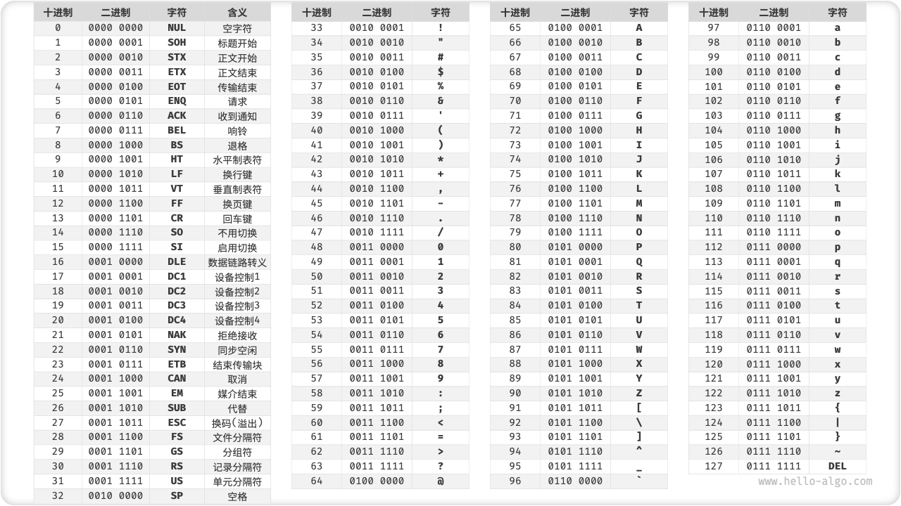

# 字符编码

> 计算机中，所有数据都是以二进制数的形式存储的，而为了表示字符，就需要建立一套字符集，让每个字符与二进制数之间有一一对应的关系

## 1.ASCII字符集

美国信息交换标准代码使用7位二进制数表示一个字符，最多表示128个不同的字符

但是，ASCII码只能表示英文，后来诞生了一种能表示256个不同字符的8位编码EASCII

## 2.GBK字符集

中国国家标准总局于 1980 年发布了「GB2312」字符集，其收录了 6763 个汉字，基本满足了汉字的计算机处理需要。

然而，GB2312 无法处理部分的罕见字和繁体字。「GBK」字符集是在 GB2312 的基础上扩展得到的，它共收录了 21886 个汉字。在 GBK 的编码方案中，ASCII 字符使用一个字节表示，汉字使用两个字节表示。

## 3.Unicode字符集

> 随着计算机的蓬勃发展，字符集与编码标准百花齐放，而这带来了许多问题。一方面，这些字符集一般只定义了特定语言的字符，无法在多语言环境下正常工作。另一方面，同一种语言也存在多种字符集标准，如果两台电脑安装的是不同的编码标准，则在信息传递时就会出现乱码。
>
> **如果推出一个足够完整的字符集，将世界范围内的所有语言和符号都收录其中，不就可以解决跨语言环境和乱码问题了吗**？在这种想法的驱动下，一个大而全的字符集 Unicode 应运而生。

统一字符编码，理论上能容纳一百多万个字符。它致力于将全球范围内的字符纳入到统一的字符集之中，提供一种通用的字符集来处理和显示各种语言文字，甚至是表情符号等，减少因为编码标准不同而产生的乱码问题。

在庞大的 Unicode 字符集中，常用的字符占用 2 字节，有些生僻的字符占 3 字节甚至 4 字节。但同时也十分浪费内存空间（高位填0），所以我们需要一种更高效的Unicode编码方法

## 4.UTF-8编码

UTF-8已成为国际上使用最广泛的Unicode编码方法，它是一种**可变长**的编码，使用1到4个字节来表示一个字符，根据字符的复杂性而变。ASCII 字符只需要 1 个字节，拉丁字母和希腊字母需要 2 个字节，常用的中文字符需要 3 个字节，其他的一些生僻字符需要 4 个字节