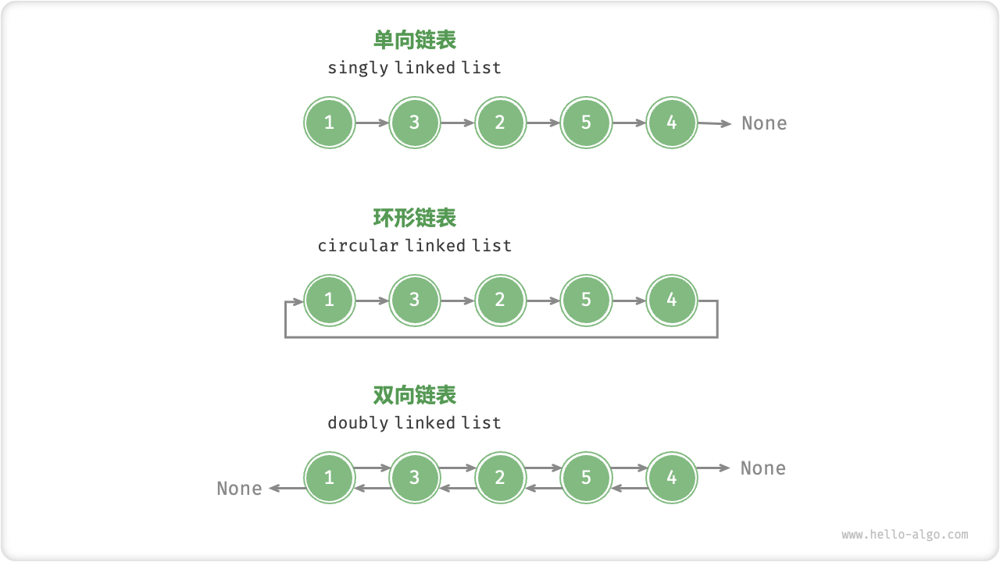

# 链表

> 链表linkedlist是一种线性数据结构，其中每个元素都是一个节点对象，各个节点之间通过引用连接，引用记录了下一个节点的内存地址
>
> 节点node都包含两项数据：节点的值和指向下一节点的引用
>
> - 链表的首个节点被称为“头节点”，最后一个节点被称为“尾节点”。
> - 尾节点指向的是“空”，它在 Java、C++ 和 Python 中分别被记为 null、nullptr 和 None 。
> - 在 C、C++、Go 和 Rust 等支持指针的语言中，上述的“引用”应被替换为“指针”。
> - 在相同数据量下，链表比数组占更多的内存空间

## 2.链表常用操作

### （1）初始化链表

### （2）插入节点

只需要改变两个相邻节点的引用（执政）即可，时间复杂度为O(1)

### （3）删除节点

### （4）访问节点

访问（访问索引为index的）节点效率较低，时间复杂度为O(n)

### （5）查找节点

遍历链表，查找值为target的节点，输出其在链表中的索引，此过程也属于线性查找

> 具体操作见Cpp的教程链表章节

## 2.数组VS链表

数组与链表的效率对比

|            |           数组           |     链表     |
| :--------: | :----------------------: | :----------: |
|  存储方式  |       连续内存空间       | 分散内存空间 |
| 缓存局部性 |           友好           |    不友好    |
|  容量扩展  |        长度不可变        |  可灵活扩展  |
|  内存效率  | 占用内存少、浪费部分空间 |  占用内存多  |
|  访问元素  |           O(1)           |     O(n)     |
|  添加元素  |           O(n)           |     O(1)     |
|  删除元素  |           O(n)           |     O(1)     |

**数组要求相同类型的元素，而在链表中却没有强调同类型**

链表由结点组成，结点之间通过引用（指针）连接，各个结点可以存储不同类型的数据，例如 int、double、string、object 等。

相对地，数组元素则必须是相同类型的，这样才能通过计算偏移量来获取对应元素位置。例如，如果数组同时包含 int 和 long 两种类型，单个元素分别占用 4 bytes 和 8 bytes ，那么此时就不能用以下公式计算偏移量了，因为数组中包含了两种长度的元素

元素内存地址 = 数组内存地址 + 元素长度 * 元素索引

## 3.常见链表类型

### （1）单向链表

即上述介绍的普通链表

### （2）环形链表

令单向链表的尾节点指向头节点，首尾相连

在环形链表中，任意节点都可视为头节点

### （3）双向链表

与单向链表相比，双向链表记录了两个方向的引用，双向链表的节点定义同时包含后继节点和钱去节点

双向链表更具灵活性，可以朝两个方向遍历链表，但相应地也需要占用更多的内存空间

## 4.链表的典型引用

### （1）单向链表

> 单向链表通常用于实现栈、队列、哈希表和图等数据结构

* 栈与队列：
  * 当插入和删除都在链表的一端进行时，他表现出先进后出的特性，对应栈
  * 当插入在链表的一端进行，删除在另一端进行，表现出先进先出的特性，对应队列
* 哈希表：链地址法是解决哈希冲突的主流方案之一，方案中所有冲突的元素都会被放到一个链表中
* 图：邻接表时表示图的一种常用方式，在图中，图的每个顶点都与一个链表相关联，链表中的每个元素都代表与该顶点相连的其他顶点

### （2）循环链表

> 循环链表常被用于需要周期性操作的场景，比如操作系统的资源调度

* 时间片轮转调度算法：在操作系统中，时间片轮转调度算法是一种常见的 CPU 调度算法，它需要对一组进程进行循环。每个进程被赋予一个时间片，当时间片用完时，CPU 将切换到下一个进程。这种循环的操作就可以通过循环链表来实现

* 数据缓存区：在某些数据缓冲区的实现中，也可能会使用到循环链表。比如在音频、视频播放器中，数据流可能会被分成多个缓冲块并放入一个循环链表，以便实现无缝播放

### （3）双向链表

> 双向链表常被用于需要快速查找前一个和下一个元素的场景

* 高级数据结构:比如在红黑树、B 树中，我们需要访问节点的父节点，这可以通过在节点中保存一个指向父节点的引用来实现，类似于双向链表
* 游览器历史：在网页浏览器中，当用户点击前进或后退按钮时，浏览器需要知道用户访问过的前一个和后一个网页。双向链表的特性使得这种操作变得简单
* LRU算法：在缓存淘汰算法（LRU）中，我们需要快速找到最近最少使用的数据，以及支持快速地添加和删除节点。这时候使用双向链表就非常合适