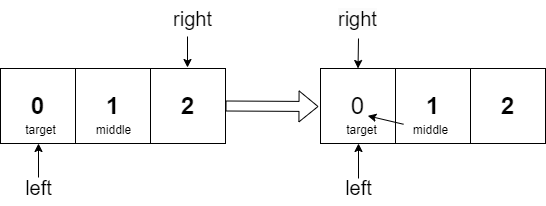
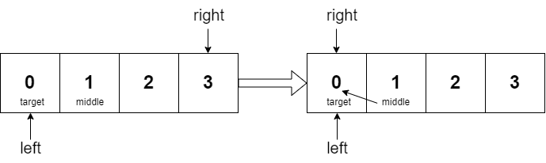
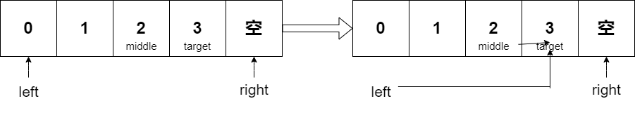
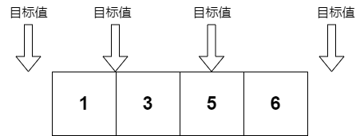

# 二分法


## 前提

使用二分法时，数组一定要是有序（单调）的，或者是二分后，能否判断出答案所在的区间


## 题目（二分查找）

```makefile
给定一个 n 个元素有序的（升序）整型数组 nums 和一个目标值 target  ，写一个函数搜索 nums 中的 target，如果目标值存在返回下标，否则返回 -1。


示例 1:
输入: nums = [-1,0,3,5,9,12], target = 9
输出: 4
解释: 9 出现在 nums 中并且下标为 4

示例 2:
输入: nums = [-1,0,3,5,9,12], target = 2
输出: -1
解释: 2 不存在 nums 中因此返回 -1
 
提示：
你可以假设 nums 中的所有元素是不重复的。
n 将在 [1, 10000]之间。
nums 的每个元素都将在 [-9999, 9999]之间。
```


## 思路

题目为有序数组 ，并且还强调数组中无重复的元素 ，因为一旦有重复的元素 ，使用二分找法返回的元素下标可能就不是唯一的了。

二分查找涉及很多边界的问题 ，到底是while (left < right) 还是 while (left <= right) , 到底是right = middle 还是 right = middle - 1 ？所以我们要弄清楚 **区间** ，注意边界处理 。


### 写法一：left <= right（左闭右闭[left , right])

* 元素个数奇数



* 元素个数偶数


```cpp
class Solution {
public:
    int search(vector<int>& nums, int target) {
        int left = 0;
        int right = nums.size() - 1; //定义target在闭区间内[left ,right]
        while (left <= right) //当left = right 时区间仍有效
        {
            int middle = left + (right - left) / 2; //防止溢出
            if(nums[middle] < target) //target在右区间
            {
                left = middle + 1;
            }
            else if(nums[middle] > target) //target在左区间
            {
                right = middle - 1;
            }
            else
            {
                return middle; //最后middle指向的是target的位置
            }
            
        }
        return -1; //否则返回-1

    }
};
时间复杂度：O(log n)
空间复杂度：O(1)
```


### 写法二：left < right (左闭右开[left , right))



```cpp
class Solution {
public:
    int search(vector<int>& nums, int target) {
        int left = 0;
        int right = nums.size(); //定义target在闭区间内[left ,right)
        while (left < right) //当left = right 时是无效的，故＜
        {
            int middle = left + (right - left) / 2; //防止溢出
            if(nums[middle] < target) //target在右区间
            {
                left = middle + 1 ;
            }
            else if(nums[middle] > target) //target在左区间
            {
                right = middle;
            }
            else
            {
                return middle; //最后middle指向的是target的位置
            }
            
        }
        return -1; //否则返回-1

    }
};
时间复杂度：O(log n)
空间复杂度：O(1)
```


## 题目（搜索插入位置）

```
给定一个排序数组和一个目标值，在数组中找到目标值，并返回其索引。如果目标值不存在于数组中，返回它将会被按顺序插入的位置。

示例 1:
输入: nums = [1,3,5,6], target = 5
输出: 2

示例 2:
输入: nums = [1,3,5,6], target = 2
输出: 1

示例 3:
输入: nums = [1,3,5,6], target = 7
输出: 4
 
提示:
1 <= nums.length <= 104
-104 <= nums[i] <= 104
nums 为 无重复元素 的 升序 排列数组
-104 <= target <= 104
```


## 思路

先分析要在数组中插入目标值的位置 , 有以下四种情况:



* 在所有元素之前（最后left=0，right=1）
* 插入数组中的位置 （在left位置，right比left正好小1）
* 等于数组中某一元素 （return target）
* 在所有元素之后 （在left位置，right比left正好小1）


### 写法一：二分法

```cpp
class Solution {
public:
    int searchInsert(vector<int>& nums, int target) {
        int n = nums.size();
        int left = 0;
        int right = n - 1; // 定义target在左闭右闭的区间里，[left, right]
        while (left <= right) { // 当left==right，区间[left, right]依然有效
            int middle = left + ((right - left) / 2);// 防止溢出 等同于(left + right)/2
            if (nums[middle] > target) {
                right = middle - 1; // target 在左区间，所以[left, middle - 1]
            } else if (nums[middle] < target) {
                left = middle + 1; // target 在右区间，所以[middle + 1, right]
            } else { // nums[middle] == target
                return middle;
            }
        }
        // 目标值在数组所有元素之前  [0, -1]
        // 目标值等于数组中某一个元素  return middle;
        // 目标值插入数组中的位置 [left, right]，return  right + 1
        // 目标值在数组所有元素之后的情况 [left, right]， 因为是右闭区间，所以 return right + 1
        return right + 1;
    }
};
时间复杂度：O(log n)
空间复杂度：O(1)
```

### 写法二：暴力解法

```cpp
class Solution {
public:
    int searchInsert(vector<int>& nums, int target) {
        for (int i = 0; i < nums.size(); i++) {
        // 分别处理如下三种情况
        // 目标值在数组所有元素之前
        // 目标值等于数组中某一个元素
        // 目标值插入数组中的位置
            if (nums[i] >= target) { // 一旦发现大于或者等于target的num[i]，那么i就是我们要的结果
                return i;
            }
        }
        // 目标值在数组所有元素之后的情况
        return nums.size(); // 如果target是最大的，或者 nums为空，则返回nums的长度
    }
};
暴力解题 不一定时间消耗就非常高，关键看实现的方式，就像是二分查找时间消耗不一定就很低，是一样的
时间复杂度：O(n)
空间复杂度：O(1)
```

