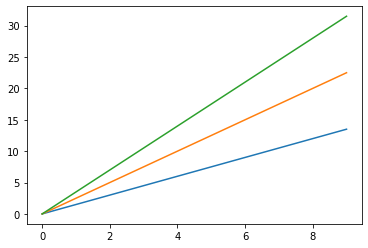
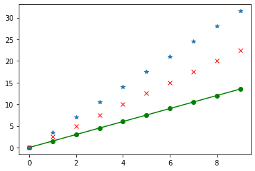
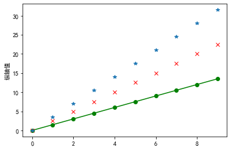

[TOC]

# 1.简介

> python优秀的数据可视化第三方库
>
> 由各种可视化类构成，内部结构复杂，受matlab启发

matplotlib.pyplot是绘制各类可视化图形的命令子库，相当于快捷方式

```py
import matplotlib.pyplot as plt #引入模块别名
```


# 2.pyplot的plot()函数

```py
plt.plot(x,y,format_string,**kwarges)
```

* x：X轴数据，列表或数组
* y：Y轴数据，列表或数组
* format_string：控制曲线格式字符串
* **kwarges：第二组或更多(x,y,format_string），同时绘制多条曲线
* 当绘制多条曲线时，x不能省略；绘制一条曲线，x轴数据可省掉

## a）基本使用

```py
import matplotlib.pyplot as plt 
import numpy as np
a=np.arange(10)
plt.plot(a,a*1.5,a,a*2.5,a,a*3.5)
plt.show()
```



## b）format_string

> 由颜色字符，风格字符，标识字符组成

| 颜色字符  |    说明    | 颜色字符 |     说明      |
| :-------: | :--------: | :------: | :-----------: |
|    'b'    |    蓝色    |   'm'    | 洋红色magenta |
|    'g'    |    绿色    |   'y'    |     黄色      |
|    'r'    |    红色    |   'k'    |     黑色      |
|    'c'    | 青绿色cyan |   'w'    |     白色      |
| '#008000' | RGB某颜色  |  '0.8'   | 灰度值字符串  |

| 风格字符 |  说明  |
| :------: | :----: |
|   '-'    |  实线  |
|   '--'   | 坡折线 |
|   '-.'   | 点划线 |
|   ':'    |  虚线  |
|   " "    | 无线条 |

| 标记字符 |     说明     |
| :------: | :----------: |
|   '.'    |    点标记    |
|   ','    |   像素标记   |
|   'o'    |  实心圆标记  |
|   'v'    |  倒三角标记  |
|   'p'    | 实心五角标记 |
|   'x'    |    x标记     |
|   '*'    |   星形标记   |
|   ...    |     ...      |

```py
import matplotlib.pyplot as plt 
import numpy as np
a=np.arange(10)
plt.plot(a,a*1.5,'go-',a,a*2.5,'rx',a,a*3.5,'*')
plt.show()
```



# 3.pyplot中文显示

> pyplot并不默认支持中文显示

## a)rcParams(改全局字体)

```py
import matplotlib
matplotlib.rcParams['font.family']='SimHei'#黑体
```

```py
import matplotlib.pyplot as plt 
import numpy as np
import matplotlib
matplotlib.rcParams['font.family']='SimHei'
a=np.arange(10)
plt.plot(a,a*1.5,'go-',a,a*2.5,'rx',a,a*3.5,'*')
plt.ylabel('纵轴值')
plt.show()
```



* 'font.family'：显示字体名字 'Kaiti','LiSu','FangSong'
* 'font.style'：字体风格，正常'normal'，斜体'italic'

* 'font.size'：字体大小，整数字号或者'large','x-small'

## b）fontproperties(改部分)

>  在有中文输出的地方，增加一个属性

```py
plt.xlable('横轴：时间'，fontproperties='SimHei'，fontsize=20)
```


# 4.文本显示

## a）plt.xlable()，plt.ylable()

> 对x，y轴增加文本标签

## b）plt.title()

> 图形整体增加文本标签

## c）plt.text()

> 任意位置增加文本
>
> 要在前面加x，y坐标 

```py
plt.text(x,y,text)
```

## d）plt.annotate()

> 图形中增加带箭头的注释

```py
annotate(text, xy=arrow_crd, xytext=text_crd,arrowprops=dict)
```


# 5.子绘图区域

```py
plt.subplot2grid(shape, loc, rowspan=1, colspan=1, fig=None, **kwargs)
```

* 理念：设定网格，选中网格，确定选中行列区域数量，编号从0开始
* shape：（int，int）行列数
* loc：（int，int）轴位置的行列号

* rowspan:int，默认值：1，轴向下跨度的行数
* colspan:int，默认值：1要向右跨接的轴的列数


