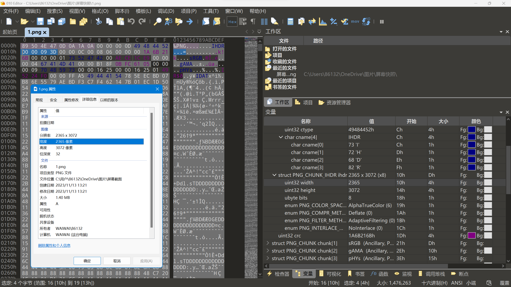

# 图片隐写术

> **Steganography （Steg）**隐写术,就是将秘密隐藏到普通信息中进行传送

[TOC]

## 一.  常见隐写方法

### 1.1 插入隐藏

利用文件的特性和文件格式的冗余性，在不影响载体正常使用情况下，将秘密信息插入到载体中，且这种方法通常会导致载体文件大小发生变化。根据秘密信息插入的位置，又可以分为**追加插入法**和**前置插入法**

* 追加插入法

  * 最常用，最简单的一种，通常在文件末尾附加数据

  * 基本原理：对于Windows系统，根据文件后缀解析载体文件，大部分文件格式都有文件结束标志，在文件结束标志后的数据不会被解析，也不会影响载体文件的使用
* 前置插入法
  * 利用文件头部的冗余部分进行插入，并且不影响原始数据的使用效果

### 1.2 替换隐藏

通过修改载体文件的数据，将原始载体内不重要的数据替换成所要隐藏的信息。若只修改部分字节，人眼几乎无法发现原图像发生了变化。最常见的替换隐藏是**最低比特隐写（least significant bit）LSB**,通过修改区域内像素值的八位二进制的最低位，将信息隐藏在最低位


## 二. 文件头文件尾汇总

|       文件类型       |         文件头          |               文件尾                |  头特征  |
| :------------------: | :---------------------: | :---------------------------------: | :------: |
|      PNG (png)       | 89 50 4E 47 0D 0A 1A 0A | 00 00 00 00 49 45 4E 44 AE 42 60 82 | ‰PNG.... |
|      JPEG (jpg)      |        FF D8 FF         |                FF D9                |   ÿØÿà   |
|      GIF (gif)       |       47 49 46 38       |                00 3B                |  GIF89a  |
| Windows Bitmap (bmp) |          42 4D          |                                     |    BM    |
| Adobe Acrobat (pdf)  |  25 50 44 46 2D 31 2E   |                                     |   %PDF   |


## 三. 一些图像基本概念

### 3.1 图像深度

存储每个像素所用的位数，他也是用来度量图像的色彩分辨率的

### 3.2 图像通道数

* 单通道——灰度图（每个像素点的像素值只用一个值表示）
* 三通道——彩色图（有RGB三种颜色来描述）
* 四通道——三通道基础上加alpha通道组成（表示图片的透明和半透明度）（0-完全透明，255-完全不透明）


## 四. PNG文件格式及隐写方法

### 4.1 png图片简介

PNG（Portable Network Graphics），便携式网络图形，是一种采用无损压缩算法的位图格式，支持索引、灰度、RGB三种颜色方案以及Alpha通道等特性。其设计目的是试图替代GIF和TIFF文件格式，同时增加一些GIF文件格式所不具备的特性。PNG使用从LZ77派生的无损数据压缩算法，一般应用于JAVA程序、网页或S60程序中，原因是它压缩比高，生成文件体积小。PNG文件的扩展名为.png

### 4.2 png图片格式构成

PNG图像格式的文件由一个8字节的文件头和数据块组成，文件头为`89 50 4E 47 0D 0A 1A 0A`（十六进制）（每个十六进制数占0.5个字节，也就是4比特0000~1111）

`文件头+数据块+数据块+......+文件尾`

* 数据块类型：

  * 关键数据块（critical chunk），这是必需的数据块

  * 辅助数据块（ancillary chunks），这是可选的数据块

* 同时，每个数据块都由四部分组成

  |              名称              |  字节数  |                         说明                         |
  | :----------------------------: | :------: | :--------------------------------------------------: |
  |         Length (长度)          |  4字节   | 指定数据块中数据域的长度，其长度不超过(2^31－1^)字节 |
  | Chunk Type Code (数据块类型码) |  4字节   |        数据块类型码由ASCII字母(A-Z和a-z)组成         |
  |    Chunk Data (数据块数据)     | 可变长度 |          存储按照Chunk Type Code指定的数据           |
  |       CRC (循环冗余检测)       |  4字节   |          存储用来检测是否有错误的循环冗余码          |

* 常见的4个关键数据块类型（对应于数据块类型码）：
  - **文件头数据块 IHDR（header chunk）**：包含有图像基本信息，作为第一个数据块出现并只出现一次。
  - **调色板数据块 PLTE（palette chunk）**：必须放在图像数据块之前。
  - **图像数据块 IDAT（image data chunk）**：存储实际图像数据。PNG 数据允许包含多个连续的图像数据块。
  - **图像结束数据 IEND（image trailer chunk）**：放在文件尾部，表示 PNG 数据流结束。

### 4.3 关键数据块类型

#### 4.3.1  IHDR

文件头数据块IHDR(header chunk)：它包含有PNG文件中存储的图像数据的基本信息，并要作为第一个数据块出现在PNG数据流中，而且一个PNG数据流中只能有一个文件头数据块

==数据从第 16字节开始，有13个字节，其前8字节分别用4个字节规定了图片的宽和高==（十六进制，以像素为单位）

文件头数据块由13字节组成，它的格式如下表所示

| 域的名称           | 字节数  | 说明                                                         |
| ------------------ | ------- | ------------------------------------------------------------ |
| Width              | 4 bytes | 图像宽度，以像素为单位                                       |
| Height             | 4 bytes | 图像高度，以像素为单位                                       |
| Bit depth          | 1 byte  | 图像深度： 索引彩色图像：1，2，4或8；灰度图像：1，2，4，8或16；真彩色图像：8或16 |
| ColorType          | 1 byte  | 颜色类型： 0：灰度图像, 1，2，4，8或16；2：真彩色图像，8或16；3：索引彩色图像，1，2，4或8；4：带α通道数据的灰度图像，8或16；6：带α通道数据的真彩色图像，8或16 |
| Comdivssion method | 1 byte  | 压缩方法(LZ77派生算法)                                       |
| Filter method      | 1 byte  | 滤波器方法                                                   |
| Interlace method   | 1 byte  | 隔行扫描方法： 0：非隔行扫描1： Adam7(由Adam M. Costello开发的7遍隔行扫描方法) |



用010editor解析结果如上图所示，除了png文件头，其他所有数据块构成一个数组，chunk[0]就是IHDR块

### 4.4 常见题型

* 插入隐藏
* LSB隐写：png图像一般由RGB构成，alpha默认全为0，每一种颜色占8比特

* 如果图片非常模糊，呈雪花状，可能使alpha通道隐写信息


## 五. JPG文件格式及隐写方法

### 5.1 jpg图片简介

JPEG是Joint Photographic Experts Group(联合图像专家组)的缩写，支持有陨压缩，不支持透明，不支持动画，非矢量，是24位的图像文件格式，也是一种高效率的压缩格式，是面向连续色调静止图像的一种压缩标准。同样一幅画面，用.jpg/.jpeg格式储存的文件是其他类型图形文件的1 /10～1/20。一般情况下，.jpg/.jpeg文件只有几十KB，而色彩数最高却可达到24位，所以它被广泛运用在Internet上，以节约宝贵的网络传输资源

JEPG同JPG的区别

```text
JPEG既可作为扩展名，又能代表文件格式
JPG是JPEG的简写，代表扩展名
JPEG和JPG基本上是没有区别的，它们的格式也是通用的
```

JPEG文件使用的颜色空间是CCIR 601推荐标准进行的彩色空间(参看第7章)。在这个彩色空间中，每个分量、每个像素的电平规定为255级，用8位代码表示。从RGB转换成YCbCr空间时，使用下面的精确的转换关系：

Y = 256 * E'y

Cb = 256 * [E'Cb] + 128

Cr = 256 * [E'Cr] + 128

### 5.2 jpg文件格式构成

文件按“段”的格式来组织储存，一个文件由多个段组成，每个段代表不同的信息。

常见数据段：

| marker        | marker名称             | 含义                                                 |
| ------------- | ---------------------- | ---------------------------------------------------- |
| 0xFFD8        | SOI（start of image）  | 图像开始(Start of Image)                             |
| 0xFFD9        | EOI（end of image）    | 图像结束(End of Image)                               |
| 0xFFC0        | SOF0（start of frame） | 帧开始(Start of Frame 0)（定义了图片基本信息，宽高） |
| 0xFFC4        | DHT                    | 霍夫曼(Huffman)表                                    |
| 0xFFDA        | SOS                    | 扫描线开始                                           |
| 0xFFDB        | DQT                    | 量化表                                               |
| 0xFFE0        | APP0                   | JFIF(JPEG File Interchange Format)应用数据块         |
| 0xFFE1~0xFFEF | APPn                   | 其它的应用数据块(n, 1~15)                            |
| 0xFFFE        | COM（comment）         | 注释段                                               |

### 5.3常见出题套路

* 插入：可交换图像文件格式常被简称为Exif（Exchangeable image file format），是专门为数码相机的照片设定的，可以记录数码照片的属性信息和拍摄数据。Exif 可以被附加在 JPEG、TIFF、RIFF 等文件之中，为其增加有关数码相机拍摄信息的内容和缩略图或图像处理软件的一些版本信息，图片右击属性，查看exif或查看详细信息，在相关选项卡中查找flag信息。在kali上运用“strings+图片名”进行查看

* jpg图像没有保存rgb信息，一般不考虑lsb，但也有其他的隐写方法

  * JSteg，OutGuess，Jphide隐写算法，JPHS，Steghide，Stegdetect工具

  * Stegdetect可检测JSteg、JPHide、OutGuess、Invisible Secrets、F5、appendX和Camouflage等这些隐写工具隐藏的信息，通过命令行交互

  * ```
    stegdetect xxx.jpg
    stegdetect -s 灵敏度 xxx.jpg
    ```

  * 除了命令行，也可以使用图形化界面工具xsteg.exe(注意灵敏度调为10)
  * 

1.Fireworks

使用winhex打开文件时会看到文件头部中包含firework的标识，通过fireworks可以找到隐藏图片

使用场景：查看隐写的图片文件

2.Exif

Exif按照JPEG的规格在JPEG中插入一些图像/数字相机的信息数据以及缩略图像

图片右击属性，查看exif或查看详细信息，在相关选项卡中查找flag信息

3.Stegsolve

当两张jpg图片外观，大小，像素都基本相同时，可以考虑进行结合分析，即将两个文件的像素RGB值进行xor，add，sub等操作，看能否得到有用的信息，stegsolve可以方便的进行这些操作

使用场景：两张图片信息基本相同

4.LSB(最低有效位least significant bit)

LSB替换隐写基本思想是用嵌入的秘密信息取代载体图像的最低比特位，原来的7个高位平面与替代秘密信息的最低位平面组合成含隐藏信息的新图形

注意：用自带的画图工具转换图片后缀

（1）使用stegsolve

analyse-data extract-最低位为0-改变bit plane order

2）使用zsteg工具

Linux下使用，更为方便

```cmd
zsteg filename
```

（3）wbstego4工具

解密通过lsb加密的图片（常用于.bmp或.pdf的图片)

（4）python脚本

（5）TweakPNG

tweakpng是一款png图像浏览工具，允许查看和修改一些png图像文件的元信息存储

使用场景：

* 文件头正常却无法打开文件，利用tweakpng修改CRC

* 有时CRC没有错，可能是图片的高度或宽度错误

（6）BFtools

使用场景：在Windows的cmd下，对加密过的图片文件进行解密

```cmd
bftools.exe decode braincopter 要解密的文件名 --output 输出文件名
bftools.exe run 上一步输出的文件
```

（7）SilentEye

使用场景：windows下打开silenteye工具（可以将文字或者文件隐藏到图片的解密工具），对加密的图片进行解密


（8）JPG图像加密

stegdetect工具探测加密方式 

Stegdetect程序主要用于分析JPEG文件。 因此用Stegdetect可以检测到通过JSteg、JPHide、OutGuess、Invisible Secrets、F5、appendX和Camouflage等这些隐写工具隐藏的信息

```cmd
stegdetect xxx.jpg
stegdetect -s 灵敏度 xxx.jpg
```

