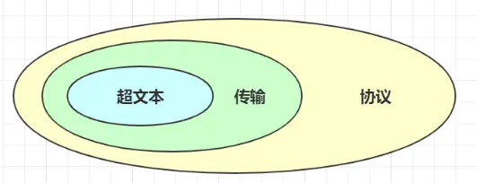
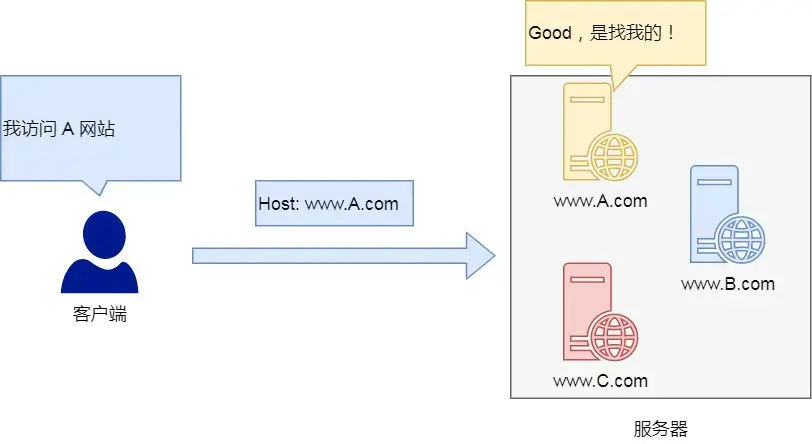
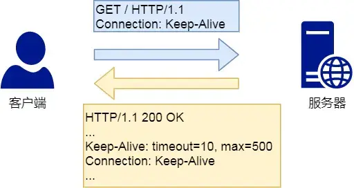
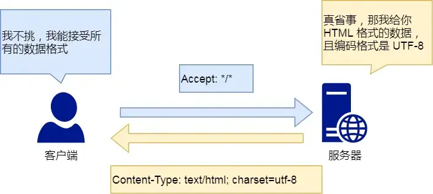
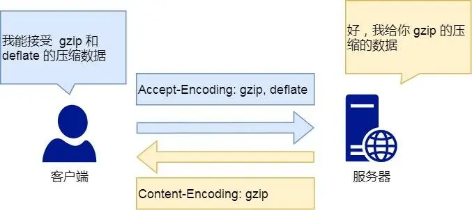

# HTTP基本概念

[TOC]

## 1.是什么

HTTP是超文本传输协议，也就是HyperText Transfer Protocol

**是一个在计算机世界里专门在「两点」之间「传输」文字、图片、音频、视频等「超文本」数据的「约定和规范」**



### 超文本

HTTP传输的内容是超文本

首先文本在互联网早期只是简单的字符文字，现在涵义可以扩展到图片，视频，压缩包等，在HTTP眼里这都算文本

超文本就是超越了普通文本的文本，他是文字，图片，视频的混合体，最关键有超链接，能从一个超文本跳转到另一个超文本

HTML就是最常见的超文本，它本身只是纯文字文件，但内部用很多标签定义了图片，视频的链接，再经过游览器的解析，呈现给我你们就是一个文字，有画面的网页了

### 传输

HTTP是一个双向协议，我们在上网冲浪时，浏览器是请求方 A，百度网站就是应答方 B。双方约定用 HTTP 协议来通信，于是浏览器把请求数据发送给网站，网站再把一些数据返回给浏览器，最后由浏览器渲染在屏幕，就可以看到图片、视频了

虽然数据是在A，B之间传输，但允许有中转或接力，就好像第一排的同学想传递纸条给最后一排的同学，那么传递的过程中就需要经过好多个同学（中间人），这样的传输方式就从「A < --- > B」，变成了「A <-> N <-> M <-> B」

### 协议

HTTP 是一个用在计算机世界里的**协议**。它使用计算机能够理解的语言确立了一种计算机之间交流通信的规范（**两个以上的参与者**），以及相关的各种控制和错误处理方式（**行为约定和规范**）


## 2.HTTP常见的状态码


`1xx` 类状态码属于**提示信息**，是协议处理中的一种中间状态，实际用到的比较少。

`2xx` 类状态码表示服务器**成功**处理了客户端的请求，也是我们最愿意看到的状态。

- 「**200 OK**」是最常见的成功状态码，表示一切正常。如果是非 `HEAD` 请求，服务器返回的响应头都会有 body 数据。
- 「**204 No Content**」也是常见的成功状态码，与 200 OK 基本相同，但响应头没有 body 数据。
- 「**206 Partial Content**」是应用于 HTTP 分块下载或断点续传，表示响应返回的 body 数据并不是资源的全部，而是其中的一部分，也是服务器处理成功的状态。

`3xx` 类状态码表示客户端请求的资源发生了变动，需要客户端用新的 URL 重新发送请求获取资源，也就是**重定向**。

- 「**301 Moved Permanently**」表示永久重定向，说明请求的资源已经不存在了，需改用新的 URL 再次访问。
- 「**302 Found**」表示临时重定向，说明请求的资源还在，但暂时需要用另一个 URL 来访问。

301 和 302 都会在响应头里使用字段 `Location`，指明后续要跳转的 URL，浏览器会自动重定向新的 URL。

- 「**304 Not Modified**」不具有跳转的含义，表示资源未修改，重定向已存在的缓冲文件，也称缓存重定向，也就是告诉客户端可以继续使用缓存资源，用于缓存控制。

`4xx` 类状态码表示客户端发送的**报文有误**，服务器无法处理，也就是错误码的含义。

- 「**400 Bad Request**」表示客户端请求的报文有错误，但只是个笼统的错误。
- 「**403 Forbidden**」表示服务器禁止访问资源，并不是客户端的请求出错。
- 「**404 Not Found**」表示请求的资源在服务器上不存在或未找到，所以无法提供给客户端。

`5xx` 类状态码表示客户端请求报文正确，但是**服务器处理时内部发生了错误**，属于服务器端的错误码。

- 「**500 Internal Server Error**」与 400 类型，是个笼统通用的错误码，服务器发生了什么错误，我们并不知道。
- 「**501 Not Implemented**」表示客户端请求的功能还不支持，类似“即将开业，敬请期待”的意思。
- 「**502 Bad Gateway**」通常是服务器作为网关或代理时返回的错误码，表示服务器自身工作正常，访问后端服务器发生了错误。
- 「**503 Service Unavailable**」表示服务器当前很忙，暂时无法响应客户端，类似“网络服务正忙，请稍后重试”的意思。


## 3.HTTP常见字段

### Host字段

客户端发送请求时，用来指定服务器的域名

有了Host字段，就可以将请求发往同一台服务器上的不同网站



### Content-Length字段

服务器在返回数据时，会有content-length字段，表明本次回应的数据长度


### Connection字段

connection字段最常用于客户端要求服务器使用HTTP长连接机制，以便其他请求复用

HTTP长连接的特点时只要任意一端没有明确提出断开连接，则保持TCP连接状态

HTTP/1.1 版本的默认连接都是长连接，但为了兼容老版本的 HTTP，需要指定 `Connection` 首部字段的值为 `Keep-Alive`

开启了 HTTP Keep-Alive 机制后， 连接就不会中断，而是保持连接。当客户端发送另一个请求时，它会使用同一个连接，一直持续到客户端或服务器端提出断开连接



### Content-Type字段

content-type字段用于服务器回应时，告诉客户端，本次数据是什么格式



客户端请求的时候，可以使用 `Accept` 字段声明自己可以接受哪些数据格式。

```text
Accept: */*
```

上面代码中，客户端声明自己可以接受任何格式的数据

### Content-Encoding字段

`Content-Encoding` 字段说明数据的压缩方法。表示服务器返回的数据使用了什么压缩格式



客户端在请求时，用 `Accept-Encoding` 字段说明自己可以接受哪些压缩方法。

```text
Accept-Encoding: gzip, deflate
```