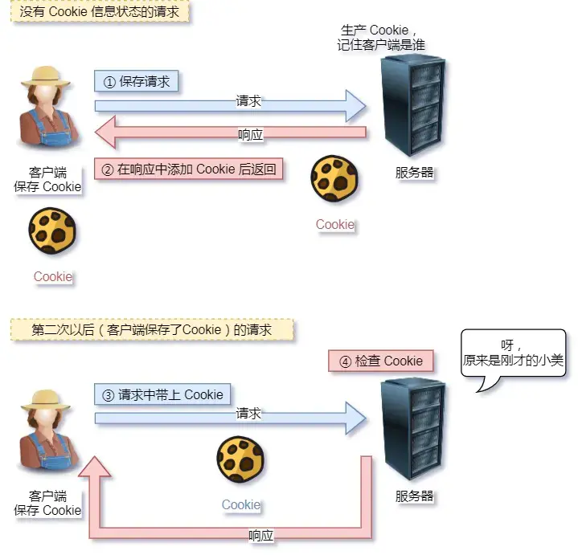

# HTTP特性

[TOC]

> 到目前为止，HTTP常见版本有HTTP/1.1，/2.2，/3.0。不同版本HTTP特性是不一样的

## 1.HTTP/1.1优点

* 简单：
  * 报文格式就是header+body，头部信息也是key-value简单文本形式，易于理解
* 灵活和易于扩展：
  * 协议的各部分没有固定死，都允许开发人员自定义和扩展
  * 下层可以随意变化：
    * HTTPS就是在HTTP与TCP层之间增加了SSL/TLS安全传输层
    * HTTP/1.1和2.0传输协议使用的是TCP协议，而HTTP/3.0传输协议改用了UDP协议
* 应用广泛和跨平台

## 2.HTTP/1.1缺点

* 无状态双刃剑：

  * 无状态的好处：因为服务器不会去记忆 HTTP 的状态，所以不需要额外的资源来记录状态信息，这能减轻服务器的负担，能够把更多的 CPU 和内存用来对外提供服务
  * 无状态的坏处：既然服务器没有记忆能力，它在完成有关联性的操作时会非常麻烦
  * 例如登录->添加购物车->下单->结算->支付，这系列操作都要知道用户的身份才行。但服务器不知道这些请求是有关联的，每次都要问一遍身份信息
  * 无状态问题的解决方案有很多种，比较简单的就是使用Cookie技术，Cookie通过在请求和响应报文中写入Cookie信息来控制客户端状态

  

* 明文传输双刃剑：传输过程的信息，是可方便阅读的，比如wireshark抓包都可以直接肉眼查看，相当于信息裸奔

* 不安全：
  * 通信使用明文
  * 不验证通信双方身份
  * 无法证明完整性

## 3.HTTP/1.1性能

> HTTP协议基于TCP/IP，并且使用【请求-应答】的通信模式，所以性能的关键就在这两点

* 长连接：

  * 早期 HTTP/1.0 性能上的一个很大的问题，那就是每发起一个请求，都要新建一次 TCP 连接（三次握手），而且是串行请求，做了无谓的 TCP 连接建立和断开，增加了通信开销
  * 为了解决上述 TCP 连接问题，HTTP/1.1 提出了**长连接**的通信方式，也叫持久连接。这种方式的好处在于减少了 TCP 连接的重复建立和断开所造成的额外开销，减轻了服务器端的负载。
  * 持久连接的特点是，只要任意一端没有明确提出断开连接，则保持 TCP 连接状态
  * 当然，如果某个 HTTP 长连接超过一定时间没有任何数据交互，服务端就会主动断开这个连接

  

* 管道网络传输：
  * 即可在同一个TCP连接里，客户端可以发起多个请求，只要第一个请求发出去了，不必等其回来们就可以发第二个请求出去，可减少整体响应时间
  * 但是服务器必须按照接收请求的顺序发送对这些管道化请求的响应
  * 但解决了请求的队头阻塞，没有解决响应的队头阻塞
  * 实际上 HTTP/1.1 管道化技术不是默认开启，而且浏览器基本都没有支持，所以**后面所有文章讨论 HTTP/1.1 都是建立在没有使用管道化的前提**。大家知道有这个功能，但是没有被使用就行了
* 队头阻塞：
  * 当顺序发送的请求序列中的一个请求因为某种原因被阻塞时，在后面排队的所有请求也一同被阻塞了，会招致客户端一直请求不到数据，这也就是「**队头阻塞**」
* 总之 HTTP/1.1 的性能一般般，后续的 HTTP/2 和 HTTP/3 就是在优化 HTTP 的性能