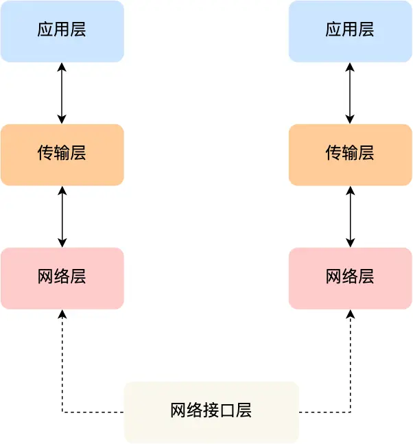

# TCP/IP 网络模型

[TOC]

## 1.应用层（Application Layer）

* 最上层的，也是我们能够直接接触到的，是工作在操作系统的用户态，传输层以下则工作在内核态
* 应用层只关注于为用户提供应用功能，比如HTTP，FTP，Telnet，DNS，SMTP
* 不用关心数据是如何传输的，就类似于寄快递的时候我们只需要把包裹交递给快递员

## 2.传输层（Transport Layer）

应用层的数据包会传递给传输层，传输层则是为应用层提供网络支持的

设计理念是简单，高效，专注

### 2.1TCP传输协议

* TCP全称为传输控制协议（Transmission Control Protocol）
* 大部分应用使用的是TCP传输层协议，比如HTTP应用层协议
* TCP相比UDP多了很多特性：
  * 流量控制
  * 超时重传
  * 拥塞控制

### 2.2UDP传输协议

* 较为简单，只负责发送数据包，不保证数据包是否能抵达对方
* 但实时性更好，传输效率也高

### 2.3TCP段（TCP Segment）

* 应用传输的数据可能非常大，因此当传输层的数据包大小超过MSS（TCP最大报文段长度），就要将数据包分块
* 如果途中有一个分块丢失或损坏，只需要重新发送这一个分块，而不需要重新发送整个数据包

### 2.4端口

* 设备作为接收方时，传输层要负责把数据包传给应用，但是一台设备上可能会有很多应用在接受或者传输数据，因此需要用一个编号将应用区分开来，这个编号就是端口
* 80端口通常是Web服务器用的，22端口通常时远程登录服务器用的
* 由于传输层的报文中会携带端口号，因此接收方可以识别出该报文是发送给那个应用的

## 3.网络层（Internet Layer）

* 传输层实际上并不负责将数据从一个设备传输到另一个设备
* 我们不希望传输层协议处理太多的事，只需要服务好应用即可，让其作为应用间数据传输的媒介，帮助实现应用到应用的通信，而实际的传输功能就交给了下一层网络层

### 3.1IP协议（Internet Protocol）

* IP协议会将传输层的报文作为数据部分，再加上IP包头组装成IP报文，若IP报文大小超过MTU（以太网中一般为1500字节）就会再次进行分片
* 网络层负责将数据从一个设备传输到另一个设备，但如何找到对方呢？因此，网络层需要有区分设备的编号
* 一般使用IP地址给设备编号，对于IPv4协议，IP地址共32位，分成了4段，每段是8位。但IP地址虽然做到了区分设备，但是寻址起来就很麻烦，难道全世界那么多设备一个个去匹配？
* 因此，IP地址分成两种意义的：
  * **1.网络号**，负责标识IP地址是属于哪个【子网】的
  * **2.主机号**，负责标识同一【子网】下的不同主机
  * 但是这需要配合**子网掩码**才能计算出IP地址的网络号和主机号
  * 在IP寻址的过程中，先匹配到相同的网络号（表示要找到同一个子网），才回去找对应的主机
* 除寻址外，IP协议还有一个重要的能力就是**路由**。在实际中，两台设备并不是用一条网线连接起来的，而是通过很多网关，路由器，交换机等连接起来的，那么就会形成很多条网络的路径，当数据包到达一个网络节点，就需要通过路由算法决定下一步走哪条路径。
* 路游戏寻址工作中，就是要寻找目标地址的子网，找到后进而把数据包转发给对应的网络内
* 所以，IP协议的寻址作用是告诉我们去往下一个目的地该朝哪个方向走，路由则是根据下一个目的地选择路径。寻址更像在导航，路由更像在操作方向盘

## 4.网络接口层（Link Layer）

* 生成IP头部后，接下来就需要交给网络接口层，在IP头部前面加上MAC头部，并封装成数据帧（Data frame）发送到网络上
* IP 头部中的接收方 IP 地址表示网络包的目的地，通过这个地址我们就可以判断要将包发到哪里，但在以太网的世界中，这个思路是行不通的
* 电脑上的以太网接口，Wi-Fi接口，以太网交换机、路由器上的千兆，万兆以太网口，还有网线，它们都是以太网的组成部分。以太网就是一种在「局域网」内，把附近的设备连接起来，使它们之间可以进行通讯的技术
* 以太网在判断网络包目的地时和 IP 的方式不同，因此必须采用相匹配的方式才能在以太网中将包发往目的地，而 MAC 头部就是干这个用的，所以，在以太网进行通讯要用到 MAC 地址
* MAC 头部是以太网使用的头部，它包含了接收方和发送方的 MAC 地址等信息，我们可以通过 ARP 协议获取对方的 MAC 地址
* 网络接口层主要为网络层提供「链路级别」传输的服务，负责在以太网、WiFi 这样的底层网络上发送原始数据包，工作在网卡这个层次，使用 MAC 地址来标识网络上的设备

* 网络接口层的传输单位是帧（frame），IP 层的传输单位是包（packet），TCP 层的传输单位是段（segment），HTTP 的传输单位则是消息或报文（message）。但这些名词并没有什么本质的区分，可以统称为数据包